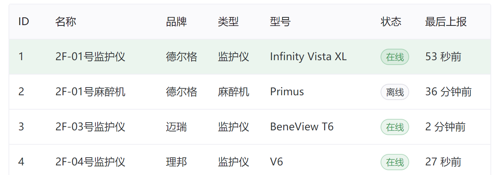
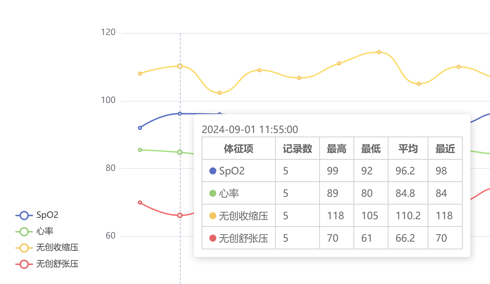

# Patient Vital Signs Data Collection System

[简体中文](./README.md) | English

## Introduction

This system collects vital sign data from various hospital monitoring devices (such as anesthesia machines, patient monitors, etc.) and provides a data query service for third-party applications.

## Features

- **Extensive Device Support**: Compatible with popular device models such as Philips, Dräger, Mindray, Biolight, Comen, Edan, GE, and Ohmeda, with the ability to add support for more devices as needed.
- **Flexible Deployment Options**: Supports both centralized and distributed deployment. Distributed nodes can temporarily store data when the network is down and automatically resume transmission when the network is restored. The system can be deployed on data collection boxes or industrial computers, adapting to different scenarios.
- **Multi-Platform Compatibility**: Supports a variety of operating systems, including Windows and Linux, and can be registered as a system service for automatic startup upon boot.
- **Multiple Network Connection Types**: The system supports direct connection to devices or data collection via servers across switches and routers. For devices without network ports, data can also be collected via serial or USB interfaces.
- **Customizable Data Collection**: Allows users to configure which vital signs to collect and supports code conversion between devices and application systems.
- **Data Structuring and Analysis**: The system provides raw data queries as well as data output at intervals of 1 minute, 5 minutes, or 1 hour, offering maximum, minimum, and average values for each time period.
- **User-Friendly Interface**: Integrated with a visual interface, the system enables real-time monitoring of each device's data and online status, making maintenance convenient.
- **Efficient and Stable**: Tested across multiple projects, the system strikes a balance between speed and stability, capable of simultaneously collecting data from hundreds of devices with minimal resource usage (1 CPU core and 1GB RAM).

## Interfaces

devices status

---

5 minutes data

## Contact Us

For more information or technical support, please reach out to us via the following methods:

Email: yusoo@qq.com

## Links

[HL7](https://www.hl7.org)

[VitalSignsCaptureSystem](https://github.com/Yusoo/VitalSignsCaptureSystem)
