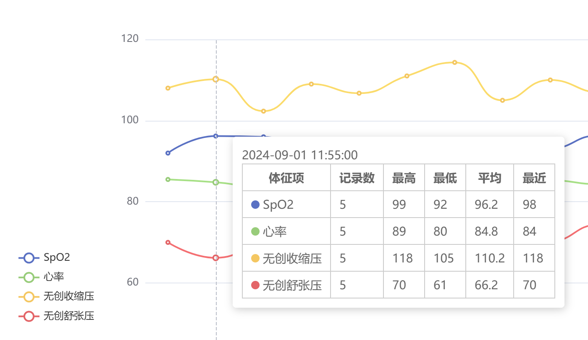

# 病人生命体征数据采集系统

简体中文 | [English](./README.en.md)

Patient Vital Signs Data Collection System

## 简介

该系统能够从医院的各种监测设备（如麻醉机、监护仪等）中采集病人的生命体征数据，并向第三方应用系统提供生命体征数据的查询服务。

## 特性

- **广泛的设备支持**：已兼容飞利浦、德尔格、迈瑞、宝莱特、科曼、理邦、通用、欧美达等常见设备型号，并可根据需求灵活扩展更多设备的支持。
- **多样的部署方式**：支持集中式和分布式部署。分布式节点在断网情况下可暂存数据，网络恢复后自动续传。该系统可部署在采集盒子或工控机上，满足不同场景需求。
- **多平台兼容**：支持 Windows 和 Linux 等主流操作系统，能够注册为系统服务，实现开机自动启动。
- **多种网络连接方式**：系统支持设备的直连采集，还可通过服务器跨交换机、路由器进行数据采集。对于没有网口的设备，也可通过串口或 USB 进行数据采集。
- **自定义采集内容**：用户可以自由配置所需的体征项采集，并支持生命体征数据代码在设备与应用系统之间的转换。
- **数据规整与分析**：系统不仅支持原始数据查询，还可以根据需求按 1 分钟、5 分钟、1 小时等时间间隔输出数据，并提供各时间段内的最高值、最低值和平均值等多维度分析。
- **可视化运维界面**：集成用户友好的可视化界面，方便运维人员实时查看每台设备的数据和在线状态。
- **高效稳定**：经过大量项目的实际验证，系统在兼顾速度与稳定性的同时保持低资源占用，1 核心 1G 内存即可支持同时采集上百台设备的数据。

## 界面

设备状态

---

每 5 分钟的数据规整

## 联系

如需了解更多信息或获取技术支持，请通过以下方式联系我们：

邮箱: yusoo@qq.com

## 链接

[HL7 协议](https://www.hl7.org)

[VitalSignsCaptureSystem](https://github.com/Yusoo/VitalSignsCaptureSystem)

[病人生命体征数据采集系统](https://yusoo.github.io/VitalSignsCaptureSystem/)
